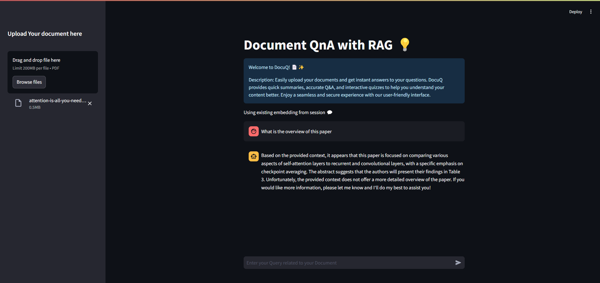

# 📄 DocuQ - Advanced Document QnA with Retrieval Augmented Generation (RAG) and Large Language Model (LLM)💡

## Overview ✨

Welcome to **DocuQ**! This powerful Streamlit application allows you to upload PDF documents and get instant, accurate answers to your questions. With **DocuQ**, you can enjoy quick summaries, precise Q&A, and interactive features to help you better understand your content.



## 🚀 Features

- **Upload PDFs**: Seamlessly upload your PDF documents and let DocuQ process them for you.
- **Instant Answers**: Ask questions related to your document and get immediate, accurate responses.
- **Contextual Summaries**: Get concise summaries and relevant information extracted from the document.
- **User-Friendly Interface**: Enjoy a smooth and intuitive experience with an easy-to-use interface.

## 🛠️ Technologies Used

- **Streamlit**: For building the interactive web application.
- **PyPDF2**: To handle PDF file reading.
- **LangChain**: For advanced document processing and question-answering.
- **FAISS**: For efficient similarity search and vector storage.
- **ChatGroq**: For leveraging the Llama3 model in document analysis.
- **GoogleGenerativeAIEmbeddings**: For generating embeddings used in document processing.
- **dotenv**: To manage API keys and environment variables securely.

## Setup and Installation

1. **Clone the repository:**

   ```bash
   git clone https://github.com/yourusername/AdvancedDocQnA-RAG.git
   cd AdvancedDocQnA-RAG
   ```

2. **Install the required packages:**

   ```bash
   pip install -r requirements.txt
   ```

3. **Set up environment variables:**

   Create a `.env` file in the root directory and add your API keys:

   ```
   GROQ_API_KEY=your_groq_api_key
   GOOGLE_API_KEY=your_google_api_key
   ```

4. **Run the Streamlit application:**

   ```bash
   streamlit run app.py
   ```

## 🎨 How to Use

1. **Run the Application**:

   ```bash
   streamlit run app.py
   ```

2. **Upload a PDF**:

   - Click on the "Upload your Pdf Here" button to upload a PDF document.
   - The application will process the document and create embeddings for it.

3. **Ask Your Questions**:
   - Enter your query related to the document in the chat input.
   - Receive accurate and contextually relevant answers based on the document content.

## 📂 File Structure

- `app.py`: Main application script.
- `requirements.txt`: List of required Python packages.
- `.env`: Environment file for API keys.
- `README.md`: This README file.

## 📋 Features in Detail

### Upload PDFs

Easily upload PDF files using the Streamlit interface. DocuQ will handle the file processing and prepare it for question-answering.

### Instant Answers

Ask questions about the content of the uploaded document. The system will use advanced language models to provide relevant and accurate answers.

### Contextual Summaries

Get brief summaries of your document’s content to quickly understand its key points.

## 🔧 Troubleshooting

- **Issue**: Application fails to run.
- **Solution**: Ensure all dependencies are installed correctly and environment variables are set up in the `.env` file.

## 🌟 Contributing

We welcome contributions to improve DocuQ! If you'd like to contribute, please fork the repository, make your changes, and submit a pull request. For major changes, please open an issue first to discuss what you would like to change.

## 📝 License

This project is licensed under the MIT License - see the [LICENSE](https://github.com/MohdRasmil7/AdvancedDocQnA-RAG/blob/main/LICENSE) file for details.
